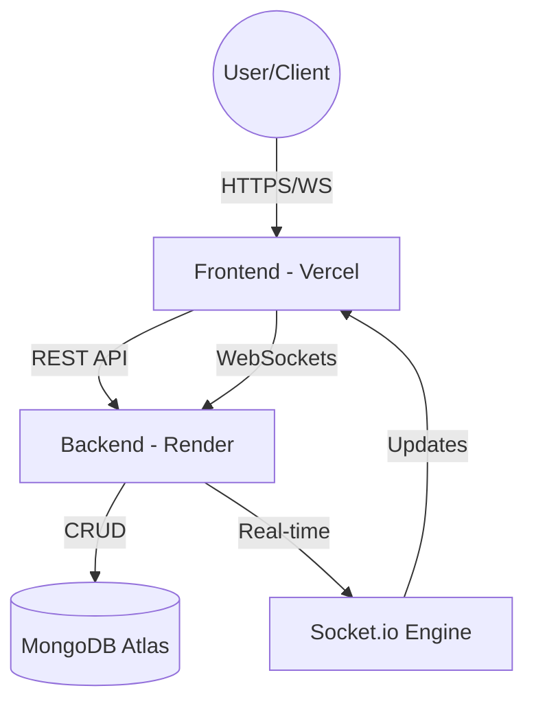

# 🏗️ FleetFlow System Architecture

This document provides a high-level overview of the FleetFlow system architecture, detailing the technical components, data flow, and security mechanisms implemented in the platform.

---

## 🌩️ High-Level Infrastructure

FleetFlow follows a modern, decoupled **Client-Server Architecture** optimized for scalability and real-time performance.

---

## 💻 Frontend Architecture (The Client)

Built on **React 19** and **Vite**, the frontend is designed as a sophisticated Single Page Application (SPA).

### 🧩 Key Layers:
1.  **View Layer (Atomic Design)**:
    *   **Pages**: Feature-rich containers managing their own internal state (e.g., `Trips.tsx`, `Vehicles.tsx`).
    *   **Components**: Highly reusable, stylized UI elements (Cards, Modals, Badges) built with **Tailwind CSS v4**.
2.  **State Management**:
    *   **AuthContext**: Manages JWT lifecycle, user profile data, and session persistence.
    *   **React Hooks**: Utilized for local state, side effects, and optimized re-rendering via `useEffect` and `useMemo`.
3.  **Service Layer**:
    *   **Axios Adapter**: Centralized API instance with request/response interceptors for automatic JWT attachment and 401 handling.
    *   **Socket.io Client**: Dedicated persistent connection for receiving live vehicle GPS updates.

---

## 🛠️ Backend Architecture (The Server)

A hardened **Node.js/Express** environment following the **MVC (Model-View-Controller)** pattern (without the 'V' in this API context).

### ⚙️ Core Modules:
1.  **Identity Engine**:
    *   Custom-built JWT authentication system.
    *   **Bcryptjs** hashing for password storage.
    *   Middleware-based **Role-Based Access Control (RBAC)** ensuring data isolation.
2.  **Communication Layer**:
    *   **RESTful endpoints**: Clean, resource-based URIs for CRUD operations.
    *   **Socket.io**: Event-driven engine for low-latency notifications and tracking data.
3.  **Performance & Hardening**:
    *   **Helmet**: Security header injection.
    *   **Morgan**: Industrial-grade request logging.
    *   **Compression**: Gzip-based response minimization.
    *   **Rate Limiter**: DDoS mitigation and API quota management.

---

## 📊 Data Architecture

FleetFlow utilizes **MongoDB** for flexible, document-based storage.

### 🗄️ Primary Schemas:
*   **Users**: Detailed profiles, encrypted credentials, preferences, and role assignments.
*   **Vehicles**: Specifications, live status, mileage logs, and health indicators.
*   **Drivers**: Performance scores, license metadata, and historical assignments.
*   **Trips**: Rich geospatial data, status history, and cargo details.
*   **Maintenance**: Service logs, cost analytics, and scheduling trees.

---

## 📡 Live Tracking Flow (GPS Sequence)

The tracking system uses a "Producer-Consumer" pattern via WebSockets:

1.  **Update**: Backend receives GPS coordinates (simulated or real).
2.  **Emit**: The server identifies active rooms (unique to each trip ID).
3.  **Stream**: `io.to(tripId).emit('location_update', data)` sends data to connected clients.
4.  **React**: Frontend receives the event and updates the Leaflet Map state without page reloads.

---

## 🔒 Security Posture

*   **Transport**: All communication (REST & WS) is forced over TLS (HTTPS).
*   **Storage**: Sensitive data (passwords) is never stored in plain text.
*   **Session**: Short-lived JWTs with client-side cleanup on logout.
*   **Isolation**: Every API request is checked against the user's role before processing.

---

*Last Updated: March 2026*
